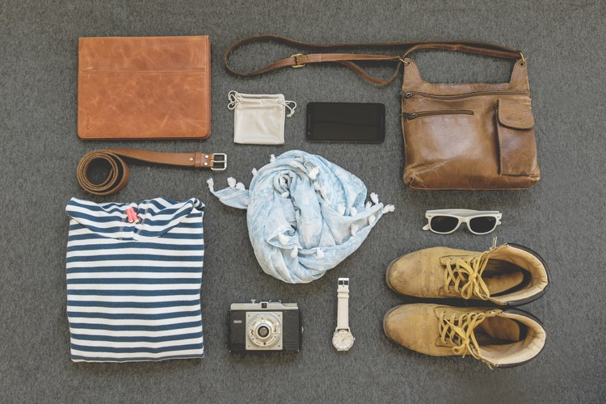

# Image compression settings assessment, reference dataset

The reference image dataset is derived from 131 images with a CC0 license, collected in Pexels and Unsplash. 

The images were selected and some of them edited to fit in a general fashion ecommerce site and to feature one or more of the following content:

- Human models and their faces
- Colorful textures
- Editing, like overlaying text or duotone effect

To analyse the impact of image resolution, high quality derivatives were created with maximum dimensions of 375, 750, 1125, 1280, 1440, and 1920 px.

This was done using ImageMagick, e.g.

`magick mogrify -resize 750x750 -sampling-factor 4:4:4 -quality 100 -strip 750/*.jpg`

This resizes all the images with a .jpg extension in the folder '750', using the highest possible quality settings.

Besides, results are offered using different compression settings in ImageMagick and with Abraia [image compressor](https://abraia.me/compressor/) that adapts compression settings to the image content.

Specifically 3 different settings were used with ImageMagick with a chroma subsampling of 4:2:0 and a quality factor of 70, 80, and 90

`magick mogrify -sampling-factor 4:2:0 -quality 70 -strip 750/*.jpg`

`magick mogrify -sampling-factor 4:2:0 -quality 80 -strip 750/*.jpg`

`magick mogrify -sampling-factor 4:2:0 -quality 90 -strip 750/*.jpg`

[Abraia](https://abraia.me) compressor has been used in auto mode, tuning both chroma subsampling and quality factor according to the content of the image, in order to minimise weight while avoiding visible artifacts at the same time.