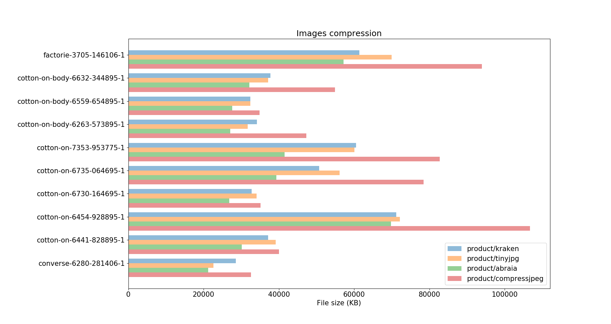

# Web image optimization benchmarking

Image optimization benchmarking on fashion ecommerce images. It compares the 
performance between three popular content-based JPEG image optimization tools: 
TinyJPG, Kraken, and [Abraia](https://abraia.me/compressor/).

```python
python eval.py product
```



The image dataset is from [guetzli-product-image-tests](
https://github.com/vinhlh/guetzli-product-image-tests/tree/master/images), and
contains 101 images from an ecommerce website.
