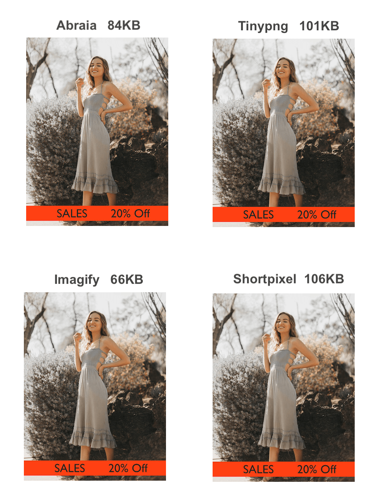

#Image optimization plugins for WordPress benchmark - Dataset

This dataset has been used to benchmark four image optimization plugins for Wordpress. The evaluation revised several objective indicators, from optimization efficiency and quality preservation, to processing speed, impact on server storage, format coverage, and price.

## Main results on optimization efficiency

We tested the plugins on a dataset with three image widths: 375px, 750px, and 1125px, which are representative of the [most important image sizes for mobile web](https://abraia.me/docs/best-image-sizes-for-web/), taking into acount both iPhone and Android screen sizes. The original images were 17 JPEG images at each of the three resolutions, compressed with a 95 quality factor, and no chroma subsampling.

The next table summarizes the weight savings achieved by each plugin after problematic settings were discarded.

   

Overall, the inspection of the images compressed with the four plugins reveals that: 

1. **Abraia** consistently produces images with good visual quality at every resolution. It manages to protect color, even at low image resolutions. At the same time it yields in general more weight savings compared to Tinypng and Shortpixel, specially in small images, and higher savings than Imagify in medium and large images.
2. **Tinypng**. It shows good visual quality consistently and at every resolution, managing to protect color effectively. It's way too conservative with small images, yielding very small weight savings at low resolutions. This is not that problematic since small images are usually light.
2. **Imagify** (Aggressive). It's too aggressive with small resolutions, introducing visible artifacts and color degradation. Likewise, it yields lower compression rates at higher resolutions where savings would have a higher impact.
3. **Shortpixel** (Glossy) is not as aggressive as Imagify. But like Imagify it has issues with vivid colors, failing to control chroma subsampling properly.

You may read the revision further in the complete post in Medium:

[Best image optimization plugins for WordPress benchmarked](https://medium.com/abraia/best-image-optimization-plugins-for-wordpress-benchmarked-20508f9a0a57)
